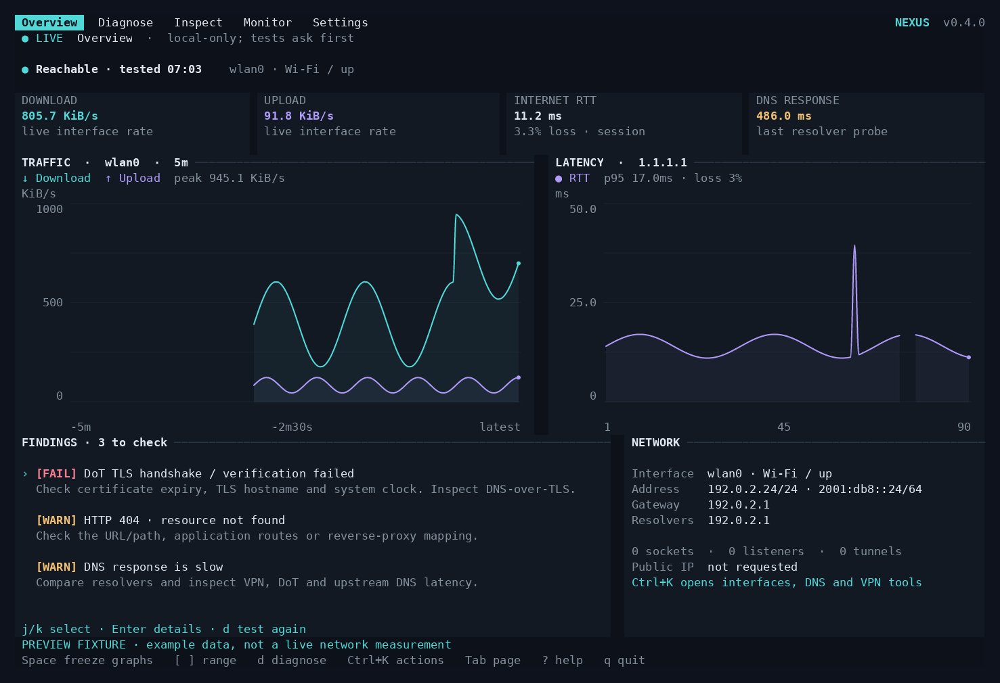
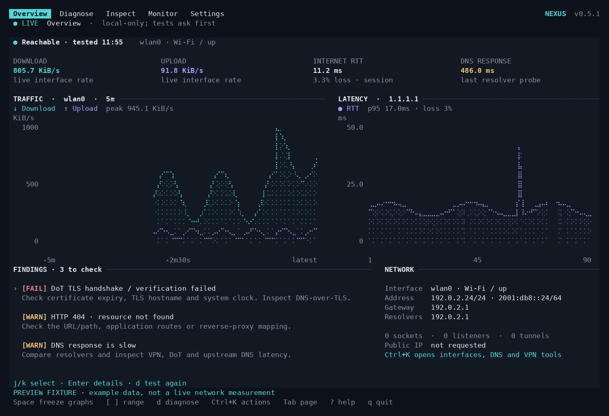

# NEXUS — Network Control Center

A full-screen Rust TUI for Linux: live networking state, diagnostics, Wi-Fi,
DNS, routes, sockets, traffic and confirmed configuration changes in one app.
Built with Ratatui, Crossterm and Tokio. It uses normalized application models,
background collectors and typed actions, rather than launching interactive
command menus.



## Install NEXUS 0.4.0

[Download release v0.4.0](https://github.com/vishnu-17o7/network-nexus/releases/tag/v0.4.0) · [All releases](https://github.com/vishnu-17o7/network-nexus/releases) · [What's new](CHANGELOG.md#040) · [Build checks](https://github.com/vishnu-17o7/network-nexus/actions)

NEXUS currently runs on **Linux**. The prebuilt packages require **x86_64 / amd64
and glibc 2.39+**, including Ubuntu 24.04+. Check with `uname -m` and
`ldd --version`. On older distributions or ARM machines, build from source.
Windows and macOS do not have native network backends in this release.

### Ubuntu / Debian package

On a compatible amd64 system, download the package and its release checksums into
an empty directory. If needed, first install `curl` and `ca-certificates` with
your package manager.

```bash
mkdir -p nexus-downloads
cd nexus-downloads
curl -fLO https://github.com/vishnu-17o7/network-nexus/releases/download/v0.4.0/nexus-net_0.4.0_amd64.deb
curl -fLO https://github.com/vishnu-17o7/network-nexus/releases/download/v0.4.0/SHA256SUMS
sha256sum --check --ignore-missing SHA256SUMS
```

Continue only if the downloaded package reports `OK`:

```bash
sudo apt install ./nexus-net_0.4.0_amd64.deb
nexus --version
nexus --doctor
nexus
```

The package installs `/usr/bin/nexus`, a manual page (`man nexus`) and a terminal
desktop launcher. It does not start a service or change network settings.
Run NEXUS as your normal user; supported changes retain their confirmation and
authorization flow. Installing a newer `.deb` with the same command upgrades the
package. To uninstall the application: `sudo apt remove nexus-net`.

### Standalone archive — no root required

The archive has the same CPU and glibc requirements. Download and verify it first:

```bash
mkdir -p nexus-downloads
cd nexus-downloads
curl -fLO https://github.com/vishnu-17o7/network-nexus/releases/download/v0.4.0/nexus-0.4.0-linux-amd64.tar.gz
curl -fLO https://github.com/vishnu-17o7/network-nexus/releases/download/v0.4.0/SHA256SUMS
sha256sum --check --ignore-missing SHA256SUMS
```

After the archive reports `OK`:

```bash
mkdir -p nexus-0.4.0
tar -xzf nexus-0.4.0-linux-amd64.tar.gz -C nexus-0.4.0
mkdir -p "$HOME/.local/bin"
install -m 755 nexus-0.4.0/nexus "$HOME/.local/bin/nexus"
"$HOME/.local/bin/nexus" --version
"$HOME/.local/bin/nexus"
```

If `nexus` is not found by name, add `export PATH="$HOME/.local/bin:$PATH"` to
your shell configuration and open a new terminal. Remove
`$HOME/.local/bin/nexus` to uninstall this copy.

### Build from source

Install **Rust 1.88 or newer** and a C compiler/linker. On Ubuntu/Debian,
`sudo apt install build-essential pkg-config git` supplies the system build tools;
install a current Rust toolchain through [rustup](https://rustup.rs/) if the
distribution's Rust is too old.

```bash
git clone --branch v0.4.0 --depth 1 https://github.com/vishnu-17o7/network-nexus.git
cd network-nexus
cargo install --locked --path .
"$HOME/.cargo/bin/nexus" --version
"$HOME/.cargo/bin/nexus"
```

For an existing checkout, `cargo run --locked --release` builds and starts the
application. Add `$HOME/.cargo/bin` to your PATH if Cargo's environment setup has
not already done so. `cargo uninstall nexus-net` removes a Cargo-installed copy.

### Terminal setup and optional tools

For smooth pixel-level curves, launch NEXUS in **Kitty or a compatible terminal
such as Ghostty**. Auto mode selects graphics for known compatible terminals;
other terminals and tmux/screen use text graphs. You can explicitly select a
renderer with `nexus --chart-renderer kitty` or `nexus --chart-renderer text`.
See [Smooth graphs](#smooth-graphs) for the complete behavior.

Recommended terminal size: **110 × 32**; compact monitoring layouts work from
**40 × 12**. Configuration confirmation requires at least **80 × 24**.

Run `nexus --doctor` to see which optional network utilities are available.
On Ubuntu/Debian, common diagnostic tools can be installed with:

```bash
sudo apt install iproute2 iputils-ping dnsutils curl openssl
```

NetworkManager, Wi-Fi, Tailscale and Pi-hole features require their corresponding
tools or services. Missing tools are reported in the UI; basic local monitoring
works without root. Do not install multiple NEXUS copies unless you intend to
manage their PATH order (`command -v nexus` shows the selected executable).

*Actual Ratatui widgets with labeled example data. [Pi-hole](docs/pihole-preview.png) · [Tailscale](docs/tailscale-preview.png) · [80×24](docs/overview-compact.png) · [60×48](docs/overview-tall.png) · [Light theme](docs/overview-light.png) · [Frozen graphs](docs/overview-paused.png)*

## First session

The Tokscale-inspired dashboard puts live metrics and smooth charts first, with findings and network context below. Download and upload have separate traces; latency retains real spikes and gaps for missing replies. Narrow terminals prioritize columns (Enter shows all fields), and tall dashboards stack the plots. A 30 FPS event loop keeps input and progress responsive; measurements update independently.

### Smooth graphs

On **Kitty or a compatible terminal advertising Kitty graphics support**, NEXUS draws antialiased vector paths, rasterizes them to the current terminal cell dimensions and transmits compressed PNGs. Auto mode recognizes `xterm-kitty`, `xterm-ghostty` and Ghostty's `TERM_PROGRAM`. Other terminals and tmux/screen use curved Braille lines. Terminal cells cannot display true pixel-level curves without a graphics protocol.

```bash
nexus --chart-renderer auto   # default: known graphics terminals, otherwise text
nexus --chart-renderer kitty  # explicit compatible-terminal override
nexus --chart-renderer text   # portable mode, including SSH / multiplexers
```

SSH can carry the image protocol when the remote session advertises the compatible terminal; tmux/screen deliberately use text. `Ctrl+K → Toggle smooth / text graphs` switches the renderer. No terminal queries or external requests are required for detection.

- **Space** freezes the graphs while collection, current metric cards and diagnostics continue. Space resumes.
- **[ / ]** selects **1 / 5 / 15 minutes** of traffic, or **30 / 90 / 300 probes** of latency. The axes are relative to the latest captured sample. Unrecorded time stays empty.
- Traffic shows the visible peak. Latency shows **p95** (nearest rank) and loss for the visible probe window; the metric card's loss is session-wide.
- Curves are display interpolation between measurements, bounded by adjacent measured values. They do not average away spikes, modify statistics or bridge missing replies. Long traffic sampling gaps break the line.
- Images are encoded only when measurements, theme, range or dimensions change. Popups, page changes, resizing and exit remove the app's image overlays. Text mode sends no image commands.
- A **STALE** header appears if no local snapshot arrives for more than three refresh intervals.



The default is local-only. Interfaces, counters, local sockets, resolver
configuration, routes and neighbor tables are read without contacting an
external service. Cached Wi-Fi data is queried without requesting a scan.

- **Ctrl+K** searches every page, tool and control.
- **Tab / Shift+Tab** or **h / l** switches pages.
- **j / k**, arrows, **g / G** and PageUp/PageDown move through tables.
- **Enter** inspects a row; **/** filters; **S** searches across local data.
- **m** toggles live ICMP monitoring. The gateway is local; configured internet
  targets and DNS test names are used only after external access is enabled.
- **e** previews enabling external requests. A single diagnostic can also be
  authorized without enabling global external access.
- **t** cycles dark, OLED, Catppuccin-inspired, Tokyo Night-inspired,
  Gruvbox-inspired and light themes.
- **u** previews a revert of the last supported network change.
- **x** cancels a diagnostic task; **q / Ctrl+C** exits and restores the terminal.

Form defaults are editable. **Ctrl+U** clears a field, **Tab** moves to the next
field, **Enter** submits, and **Esc** cancels. System changes always have a second
preview/confirmation step. Every status has a text label as well as a color.

## Tailscale and Pi-hole

Use **Ctrl+K → Open Tailscale** for local daemon state, tailnet peers, addresses, direct/DERP paths, counters, exit nodes and health warnings. It refreshes every 10 seconds while visible, after an initial successful read. The `tailscale` CLI must be installed and its daemon accessible. Peer ping and NAT/DERP checks are explicit network actions. DNS and exit-node changes read the current values and require confirmation; configure a Tailscale operator or run with appropriate permission. NEXUS never logs in or resets all preferences. The CLI preference reader is version dependent and fails safely when unavailable.

Use **Ctrl+K → Connect to Pi-hole v6**. Enter the server base URL and an application password (blank for a server without authentication). The password is masked and kept only in session memory; the URL is saved. HTTPS certificate verification stays enabled. Plain HTTP requires a trusted network and sends the password unencrypted. After a successful, explicitly authorized connection, the Pi-hole page refreshes aggregate query/blocking statistics and activity every 10 seconds. **p** pauses monitoring; **Disconnect Pi-hole monitoring** clears the connection and any captured Pi-hole undo credentials. A new app session requires reconnecting.

**Pause Pi-hole for 60 seconds** and **Resume Pi-hole blocking** read the current value and show a confirmation. A pause resumes automatically on the server. **u** previews restoration of captured settings; if the state changed, refresh before applying. Active timers prevent a new preview. App passwords may lack write permission depending on the server configuration. API errors are reported without exposing response bodies or secrets. Per-client names and queried domains are never fetched. Pi-hole v5 is not supported. API availability does not establish DNS reachability: use the DNS lookup tool with the Pi-hole resolver address for an explicit DNS test.

## Included features

| Area | Working functionality |
| --- | --- |
| Overview | Link/interface, IPv4/IPv6, gateway, DNS, traffic rates and totals, socket/listener counts, VPN hints, explicit public-IP result, measured latency/loss/DNS time, local health checks, live traffic and latency graphs |
| Interfaces | Physical/virtual/bridge/container/tunnel/loopback classification, MAC, MTU, addresses, speed/duplex, packets/errors/drops, up/down, runtime MTU, DHCP reconnect/disconnect, static IPv4/IPv6 |
| Wi-Fi | Passive cache or explicit scan, SSID/BSSID, signal, frequency/channel/security, saved profiles, WPA-personal/open and hidden-network connection, disconnect, forget, auto-connect, radio controls, channel overlap heuristic and driver airtime survey |
| Tailscale | Dedicated peer/health view, last-known direct/DERP paths, RX/TX, exit nodes, explicit ping/netcheck, confirmed DNS and exit-node controls with captured revert |
| Pi-hole v6 | Native authenticated API, blocking state/timer, aggregate queries, blocked percentage, clients, gravity domains, activity line chart, confirmed 60-second pause/resume, in-memory credentials |
| DNS | Verified native DNS-over-TLS A query with separate TCP/TLS/DNS errors, active/per-link resolver source, Cloudflare/Google/Quad9/AdGuard presets, custom/automatic settings, cache flush, A/AAAA/MX/TXT/CNAME/NS/PTR/SOA lookups, three-sample resolver comparison, resolved DoT/status/cache statistics |
| Latency / paths | Gateway and multiple configurable targets, last/min/max/mean/median/jitter/loss, bounded histories, spike/interruption events, traceroute and MTR JSON results |
| Connections / ports | TCP/UDP, IPv4/IPv6, endpoints/state/PID/process/UID, executable and inode details, established/listening/external filters, common-service labels, wildcard-bind highlighting |
| Bandwidth | Primary and per-interface rates/totals, historical traffic graph, optional explicitly authorized NetHogs process sample |
| Routing / neighbors | IPv4/IPv6 routes from all visible tables, metrics/protocols, default-route warnings, exact main-table route add/delete, policy routing rules, ARP/IPv6 neighbors |
| LAN | Explicit bounded ICMP discovery on a directly connected private /24–/30, MAC cache, locally installed OUI vendor lookup, first/last observations and known-device labels |
| Diagnostics | Prioritized findings, evidence and next steps; interface/link/IP/routes/gateway/system DNS, two direct internet TCP probes, configured HTTP endpoint and optional DoT. HTTP 404/5xx are distinguished from DNS, TLS and connectivity failures |
| Connectivity | ICMP, TCP, bounded UDP response checks, HTTP HEAD/redirects/headers/status, DNS/connect/TLS/TTFB/total timing, IPv4-versus-IPv6 HTTP comparison |
| TLS / public IP | Verified certificate subject/issuer/SAN/expiry/protocol/cipher/chain count, IPv4/IPv6 public address retrieval; optional explicit ipapi.co ASN/ISP/approximate-region lookup |
| VPN / proxy / firewall | Tunnel and default-route awareness, non-secret WireGuard peer handshake/transfer/endpoint data, Tailscale status, credential-redacted environment/GNOME proxies, read-only nftables/iptables/UFW/firewalld overview |
| Containers / development | Docker/Podman networks, drivers/IPAM/subnets/gateways/attached IPs and published ports, named/visible network namespaces, common localhost dev-port HTTP checks and same-PID port observations |
| History / profiles / reports | Local metric/event/test persistence, real speed-history chart, named DNS+MTU profiles, redacted JSON/text report, explicit detailed CLI export, optional clipboard integration |

Without a default route, traffic totals explicitly aggregate non-loopback links;
virtual/physical links can count the same traffic more than once. No fake
measurements are substituted for missing data. Failed ICMP is not
treated as proof of a complete internet outage. A wildcard listener is not
described as publicly reachable without a reachability test. The health score
is available through **four local configuration checks**; the overview instead shows prioritized findings and their evidence. Traffic includes all bytes counted by the selected interface;
it is not application payload or internet subscription speed.

## Optional system tools

Use `nexus --doctor` or the System page to see availability. On Debian/Ubuntu,
install the tools you need (this command is not run by the app):

```bash
sudo apt install iproute2 iputils-ping dnsutils traceroute mtr-tiny \
  curl openssl network-manager iw ethtool iperf3 nethogs \
  nftables policykit-1
```

Package names vary across distributions. Clipboard tools are `wl-clipboard` for
Wayland or `xclip` for X11. Firewall, container and VPN tools can be added only
when those systems are actually in use. The app does not install or enable them.

Internet speed tests support the official Ookla `speedtest --format=json` or
Python `speedtest-cli --json` backend. Ookla license/privacy acceptance must be
completed separately; the app never passes automatic acceptance flags.
Quick bandwidth tests use **5 seconds each way** against an iperf3 server you
control; full iperf tests use 15 seconds each way. No unverified HTTP download is
presented as a complete download/upload speed test.

## Permissions and configuration safety

The monitoring process can run as a normal user. NetworkManager uses its own
PolicyKit authorization. Runtime `ip` changes and resolved cache/DNS operations
use `pkexec` only after a displayed confirmation when the app is not root. A
working authentication agent is needed for interactive PolicyKit prompts.
Missing authorization fails clearly; there is no hidden sudo or shell fallback.

- Configuration previews show previous/proposed values and disruption warnings.
- Supported old values remain in memory for a separately confirmed revert.
- Multi-step failures state that earlier steps may have applied. Revert is not
  guaranteed to restore connectivity after an SSH disconnect, process exit,
  external configuration edit or a driver failure.
- Static/DNS edits change an active NetworkManager profile, then request device
  reapply. Some properties need reactivation; a reapply failure is reported and
  the app does not silently bounce the connection.
- DHCP refresh is a profile disconnect/reactivation. A DHCP RELEASE packet is
  controlled by NetworkManager policy; server-side release is not promised.
- Manual network files are read-only. Runtime MTU/routes are not written into
  arbitrary distro configuration files.
- Firewall inspection is read-only. Forgetting a Wi-Fi profile and restarting
  NetworkManager require explicit confirmation and have no guaranteed undo.
- Wi-Fi passwords are masked, passed on stdin, excluded from process arguments,
  and marked not saved in the new NetworkManager profile. Enterprise/WEP
  provisioning should be done through NetworkManager, then inspected here.
- Commands are invoked with argument arrays, no constructed shell strings.
  Output sizes and timeouts are bounded. Terminal control characters are removed.

## Settings and data

Settings use the XDG config directory, normally
`~/.config/nexus-net/config.toml`; data normally goes to
`~/.local/share/nexus-net/history.json`. New directories/files use owner-only
permissions; saves use atomic rename. History is local and can contain private
network metadata. The app has no telemetry, daemon or auto-update mechanism.

See [config.example.toml](config.example.toml). Relevant options:

```toml
theme = "dark"
refresh_seconds = 2
external_enabled = false
monitoring_enabled = false
targets = ["1.1.1.1", "8.8.8.8"]
retention_samples = 1800
```

External endpoints: public IP uses the configured `public_ip_url` (default
`https://api.ipify.org`); explicit ASN/location lookup uses ipapi.co; resolver
comparison uses four displayed public resolvers; speed tests use their selected
backend. Geo lookup is never automatic. Probes, speed tests and scans are
separate actions, so merely opening the app does not launch them.

## Headless use and verification

```bash
nexus --doctor
nexus --snapshot                  # raw local JSON; contains private metadata
nexus --report report.json        # redacted
nexus --report report.txt         # redacted text export
nexus --report private.json --include-sensitive
nexus --theme light
nexus --fresh                    # temporary session, no settings/history writes

cargo test --locked
cargo clippy --locked --all-targets -- -D warnings
cargo fmt --check
```

The report redacts endpoint/process/MAC/SSID data by default. It keeps numeric
metrics but suppresses free-form diagnostic rows that could carry identifying
details. Detailed export is a deliberate CLI choice. Wi-Fi credentials,
WireGuard private keys, proxy passwords and secret HTTP headers are not read or
exported, including in detailed mode.

See [docs/FEATURES.md](docs/FEATURES.md) for support limits and
[docs/VALIDATION.md](docs/VALIDATION.md) for actual verification evidence.

## Architecture

```text
src/model.rs          Normalized interfaces/routes/sockets/probes/results
src/backend/          NetworkBackend trait + Linux sysfs/procfs/ip collectors
src/command.rs        Argument-only process runner, bounds, timeouts, sanitizing
src/tools.rs          Async diagnostic services and backend result normalization
src/control.rs        Validated prepare/confirm/apply/revert plans
src/config.rs         XDG configuration, local history and atomic private saves
src/app.rs            Central state, actions, forms, palette, search and events
src/charts.rs         Time windows, summaries, gap handling and chart layout
src/graphics.rs       Bounded cubic paths, PNG/SVG rendering and Kitty transport
src/ui.rs             Ratatui layout, tables, modals and themes
src/main.rs           Tokio event loop, worker cancellation and terminal cleanup
```

`NetworkBackend` is the platform extension point. Windows/macOS implementations
are not included in this Linux release. The UI has no direct shell execution.
The live Linux backend uses native counters and procfs sockets, `ip -j` for
structured netlink views, and getifaddrs/ioctl/procfs address fallbacks where
netlink is restricted. The application operates in its visible network
namespace, so a container or restricted execution environment can expose less
than the full host state.

MIT licensed.

## DNS-over-TLS diagnostics

`Ctrl+K → Test DNS over TLS` asks for a resolver address, TLS certificate hostname,
query name and port (853 by default). It uses native CA trust, verifies the
hostname, sends a length-prefixed A query, and checks the response ID/question
and record framing. TCP failure, TLS/certificate failure, DNS timeout, SERVFAIL,
NXDOMAIN and REFUSED are separate results. No plaintext or insecure fallback.

To include your chosen DoT endpoint in the full diagnostic sequence, add:

```toml
dot_server = "1.1.1.1"
dot_tls_name = "cloudflare-dns.com"
```

This explicitly tests that endpoint; it does not infer that your operating
system uses DoT. The native trust loader respects `SSL_CERT_FILE` and
`SSL_CERT_DIR`. Public diagnostic TCP probes use `1.1.1.1:443` and `8.8.8.8:443`;
HTTP checks use `internet_url`. Checks run after explicit consent.

## Render and package

The images in `docs/*-preview.png` and `loading-preview.gif` render the actual
Ratatui widgets with clearly labeled example data. Smooth previews composite the exact PNG chart layer emitted by the graphics renderer; they are not mockups. The source vector paths are also saved as SVG alongside each preview buffer. `docs/dashboard.png` renders
this execution environment's live snapshot. It has restricted network visibility
and is not a snapshot of your computer.

```bash
cargo run --locked --example render_previews -- preview-buffers
python3 docs/render_preview.py preview-buffers/overview.json overview.png
cargo build --locked --release
python3 tests/graphics_pty.py target/release/nexus
python3 scripts/package.py
```

The packaging script derives architecture and minimum glibc from the ELF file,
creates `.deb` and binary `.tar.gz` releases, and writes SHA256 checksums.
GitHub workflows check the code and attach packages when a version tag is pushed.
