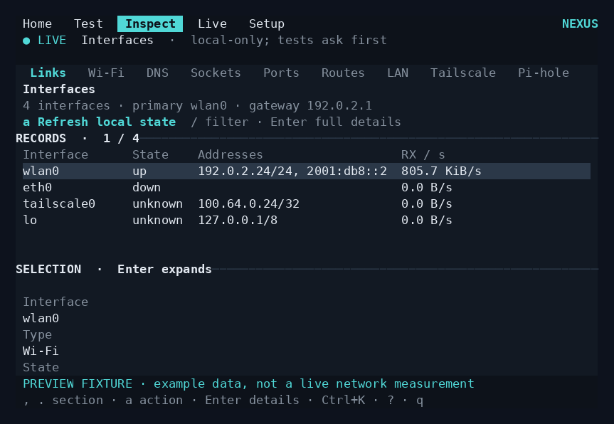
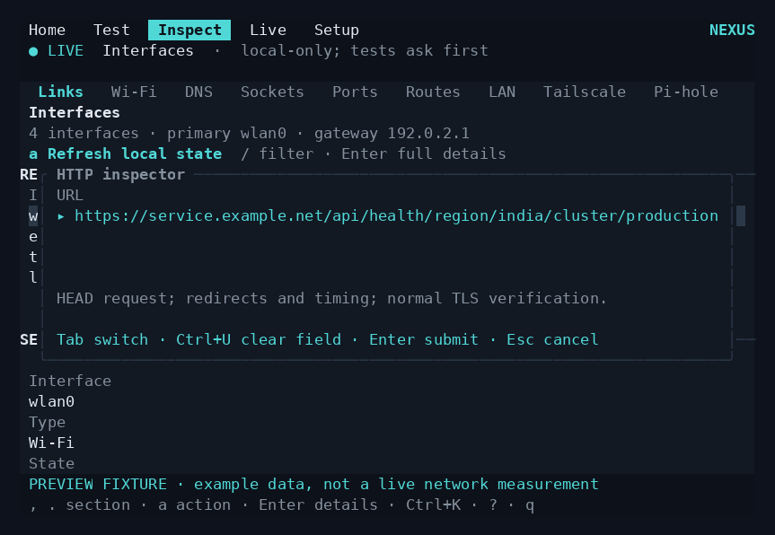
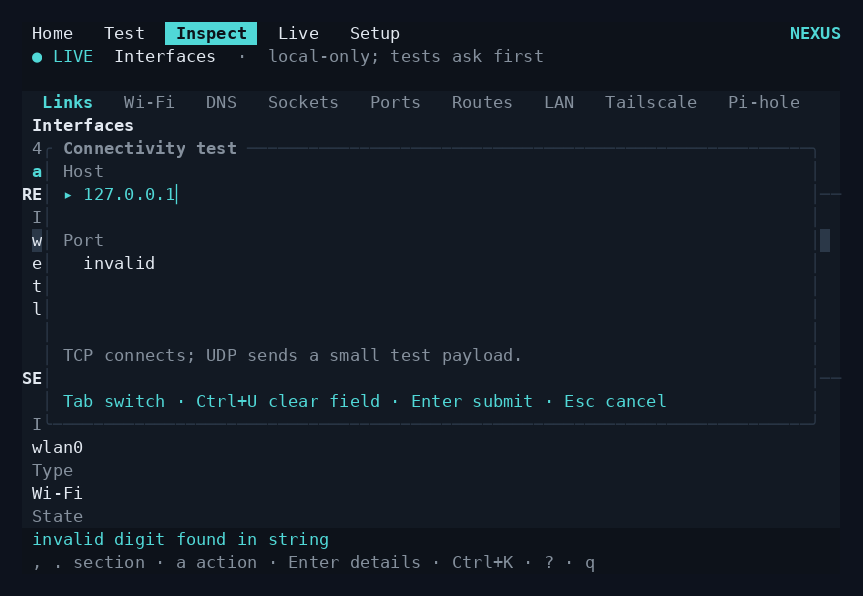
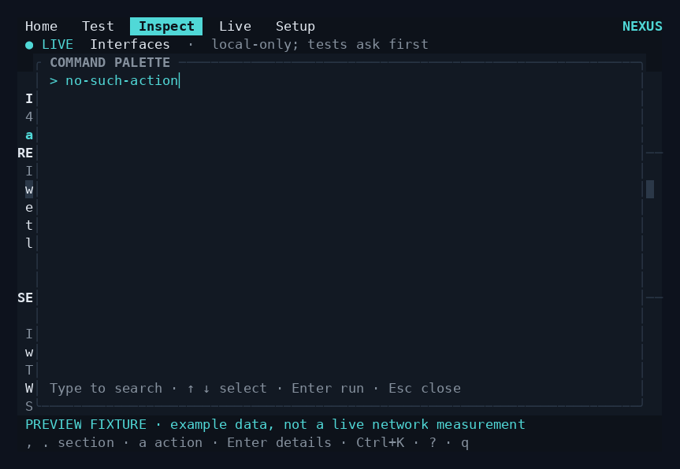
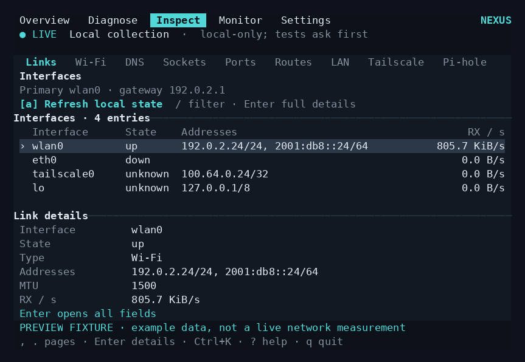
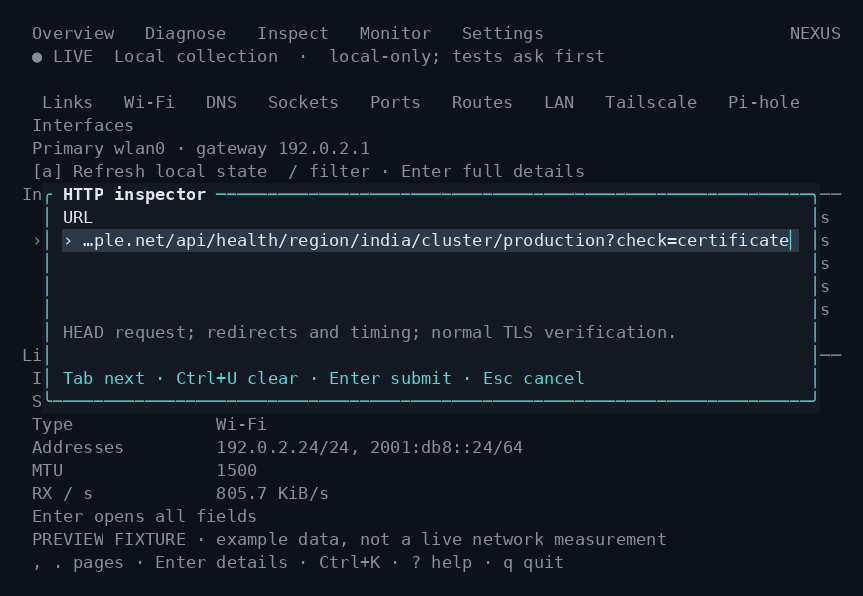
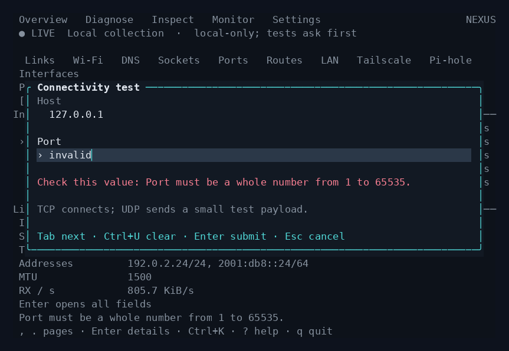
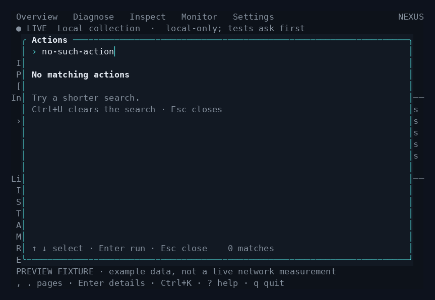

# NEXUS UI audit — 0.5.1

Review date: 4 October 2026. Baseline: released v0.5.0.
Hallmark 1.1.0 is installed from Nutlope/hallmark at 13ac0ec7e148655948100b6396439e481361d690.

## Scope and method

Inspect a local network, investigate a failure, read measurements, configure preferences/services, and use search/forms/help. Fresh renders use the actual Ratatui widgets with explicitly labeled documentation fixtures. Baseline review covers all 17 pages at 140×42, 80×24 and 60×48, empty states, and actual dispatched dialog states. These are application buffers, not a physical terminal capture or live network measurements.

| Step | Flow | Baseline health | Findings and planned correction |
| --- | --- | --- | --- |
| 1 | Scan and inspect | Needs improvement | Generic Records/Selection titles, hidden truncation, vertically stacked label/value pairs. At 80×24 the interface detail stops at State. Use descriptive headings, aligned fields and explicit ellipses. |
| 2 | Diagnose a failure | Functional, hierarchy needs polish | Large instruction blocks and repetitive headings compete with evidence. Keep the next action visible; compact findings should show more than one result where space permits. |
| 3 | Read measurements | Good foundation | Preserve the dithered traces and gaps. Tighten supporting tables and show renderer names in user language. |
| 4 | Preferences and services | Needs improvement | Repeated action hints and empty detail panes create visual clutter. Group actual settings, remove unavailable selection panes and keep connection state actionable. |
| 5 | Search, enter a target, recover from errors | Needs correction | Long URL cursor disappears; form validation errors appear behind the modal; no-result search is blank. Give overlays a consistent shell, pinned controls, visible input tail and inline errors. |

## Captured evidence

1. Inspection at 80×24: 
2. Long target input: 
3. Invalid port submission: 
4. Search without matches: 

## Design discipline

Retain the existing terminal font and semantic Theme tokens, continuous content surface, five sections, approved overview composition, and clear dithered charts. Apply Hallmark's hierarchy, spacing, focus, error-state and restraint rules within the Rust TUI. Native terminal equivalents replace CSS-only requirements. Existing network previews, external-request consent and privilege boundaries remain the interaction contract.

## Evidence limits

Rendered buffers establish layout, text visibility and color values. Keyboard behavior, terminal cleanup and graphics transport require separate tests. Physical Pi hardware, individual terminal compositors and screen-reader behavior are not established by these screenshots.

## Completed review

| Step | Final health | Implemented outcome |
| --- | --- | --- |
| 1 · Scan and inspect | Good | Purposeful list/detail titles, a selection marker, aligned fields, explicit truncation and right-aligned measurements. At 80×24 the link detail includes addresses, MTU and receive rate; Enter exposes the complete record. Empty lists use one explanation. |
| 2 · Diagnose a failure | Good | All four fixture findings fit in the compact list. The selected evidence and next step remain visible. Fewer repeated instructions compete with the findings. |
| 3 · Read measurements | Good | Existing dithered traces, sample gaps and continuous chart backgrounds retained. Supporting tables prioritize identity and numerical values. Renderer controls say Pixel/Text. |
| 4 · Preferences and services | Good | Appearance, collection and access groups improve scanning. Saved-profile actions are next to the profile. Backend and service states retain a clear next action. |
| 5 · Search, forms and help | Good | Long inputs retain a visible cursor, secrets stay masked, errors appear in a reserved inline slot, no-results search offers recovery, and grouped help/detail views have bounded scrolling. |

### After evidence

1. Inspection at 80×24: 
2. Long target input with visible cursor: 
3. Inline validation with stable dialog geometry: 
4. Search recovery: 

The [interaction gallery](polish-gallery.png) also shows preferences, the action palette and grouped help. All screenshots use the released widgets and labeled fixture data; no mock interface is substituted for the implementation.

## Verification and Hallmark review

- 65 Rust tests pass, including regressions for long Unicode/secret inputs, inline validation, search recovery and bounded help scrolling.
- Formatting and Clippy pass. All three PTY suites pass: navigation/forms, blocked-request responsiveness/cancellation, and graphics lifecycle/resize/fallback/terminal restoration.
- 112 actual widget-buffer previews generated. Visually reviewed all 17 pages at wide, compact and tall sizes, empty states, dark/light settings and all six new dialog states.
- Static built-in color-pair checks give at least 4.52:1 for the reviewed body/secondary text combinations, 6.31:1 for selected-row text, and 3.28:1 for the active cursor against the input highlight. Custom colors and terminal rendering can differ.
- Hallmark's installed audit, redesign, interaction/state and slop-test references were applied. Existing native design tokens, keyboard semantics, product identity, overview and consent flows govern where web-only rules do not apply.
- Final self-critique (1–5): philosophy 4, hierarchy 4, execution 4, specificity 5, restraint 5, variety 4. Very small terminal windows still require scrolling or Enter for complete details. A physical terminal compositor/accessibility review remains outside this verification.

Release publication requires the native amd64/ARM64 build and exact-package installation gates documented in [VALIDATION.md](VALIDATION.md).
